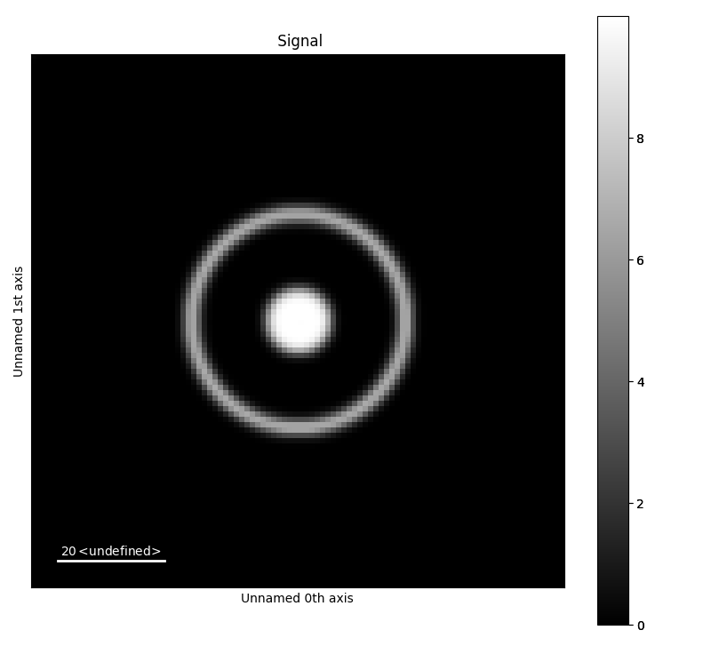
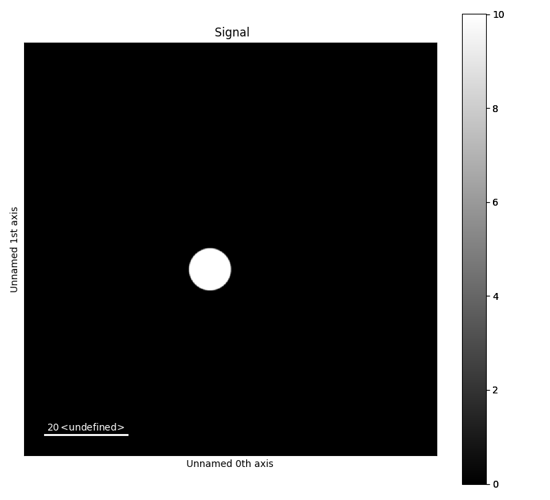
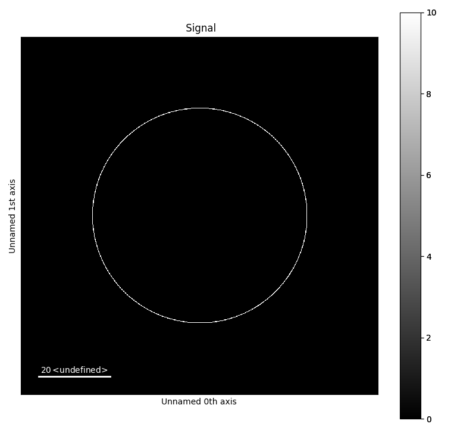
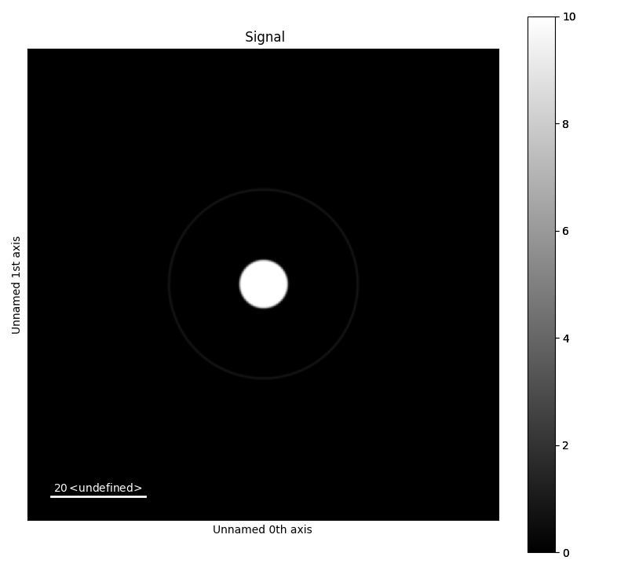
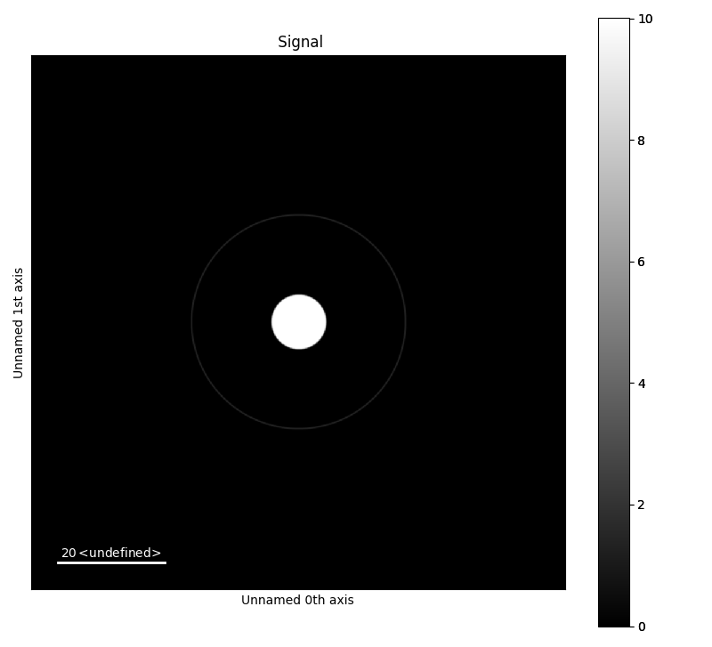

.. _generate_test_data:

====================
Generating test data
====================

With this module, test data can be generated.
Test data can be used as a dummy dataset to test processing methods.

.. code-block:: python

    >>> import fpd_data_processing.make_diffraction_test_data as mdtd

Simple examples
---------------

Generating a default image
##############################

The default settings creates test data consisting of a bright-field disk and a concentric diffraction ring.
No input parameters are needed to generate this object.
The test data contains a **PixelatedSTEM object**, which can be be plotted.

.. code-block:: python

    >>> import fpd_data_processing.make_diffraction_test_data as mdtd
    >>> import hyperspy.api as hs
    >>> a = mdtd.MakeTestData()
    >>> a.signal
    <PixelatedSTEM, title: , dimensions: (|100, 100)>
    >>> a.signal.axes_manager[0].scale
    1.0
    >>> a.signal.axes_manager[1].scale
    1.0
    >>> a.signal.plot()

Generating a bright-field disk
##############################

To generate other datasets that the default set the argument default to false, and add rings and disk manually.
The below example generates a test data image with 1000x1000 pixels, and scale 0.1.
The centre point of the disk is (45,55), and radius 5.

.. code-block:: python

    >>> a = mdtd.MakeTestData(size_x=100, size_y=100, scale=0.1, default=False)
    >>> a.signal
    <PixelatedSTEM, title: , dimensions: (|1000, 1000)>
    >>> a.signal.axes_manager[0].scale
    0.1
    >>> a.add_disk(x0=45, y0=55, r=5)

Generating a diffraction ring
#############################

A diffraction ring can be added to a MakeTestData object.
In addition to centre point radius (and intensity, as show later), the line width of the ring can be set.
The radius is defined as the distance from the centre to the centre point of the pixel at outer edge of the ring (i.e radius + half of the scale).
The line width of the ring in pixels, before it is blurred and rescaled in order to create a more smooth ring.

.. code-block:: python

    >>> a = mdtd.MakeTestData(size_x=100, size_y=100, scale=0.1,
    ...         default=False, blur=False, downscale=False)
    >>> a.add_ring(x0=50, y0=50, r=30, lw_pix=2)

Advanced diffraction images
---------------------------

Smoothing and intensity
#######################

Below are three examples with a diffraction ring and bright field disk with slightly offset centre points.
To mimic realistic patterns, the **intensity** of the ring will be set lower than the intensity of the disk.
**Blurring** and **rescaling** is used to get a smoother features, and is on by default..
The two first examples, are blurred and rescaled to make the features more smooth.
The sigma for the Gaussian blurring is different for the two to.
Rescaling is done by down and upscaling the image back to its original dimensions.
Perform rescaling by setting downscale to True.
The last image is without blurring and rescaling.

.. code-block:: python

    >>> a = mdtd.MakeTestData(size_x=100, size_y=100, scale=0.1, default=False,
    ...         blur_sigma=2)
    >>> a.add_ring(x0=50, y0=50, r=20, lw_pix=2, I=2)
    >>> a.add_disk(x0=50.05, y0=50.02, r=5, I=10)

.. code-block:: python

    >>> b = mdtd.MakeTestData(size_x=100, size_y=100, scale=0.1, default=False,
    ...         blur_sigma=1)
    >>> b.add_ring(x0=50, y0=50, r=20, lw_pix=2, I=2)
    >>> b.add_disk(x0=50.05, y0=50.02, r=5, I=10)

.. code-block:: python

    >>> c = mdtd.MakeTestData(size_x=100, size_y=100, scale=0.1, default=False,
    ...         blur=False, downscale=False)
    >>> c.add_ring(x0=50, y0=50, r=20, lw_pix=2, I=2)
    >>> c.add_disk(x0=50.05, y0=50.02, r=5, I=10)

Image offset
############

The offset of the image can be set through accessing the **axes_manager** of the **PixelatedSTEM object**.
This is useful for radial integration.
By setting the offset of the axes_manager as below, the coordinates of the centre point of the disks and ring is changed x=0 and y=0.

.. code-block:: python

    >>> a = mdtd.MakeTestData(size_x=100, size_y=100, scale=0.1,
    ...         default=False, blur_sigma=2)
    >>> a.add_ring(x0=50, y0=50, r=20, lw_pix=2, I=5)
    >>> a.add_ring(x0=50, y0=50, r=30, lw_pix=2, I=2)
    >>> a.add_ring(x0=50, y0=50, r=10, lw_pix=2, I=2)
    >>> a.add_disk(x0=50, y0=50, r=5, I=10)
    >>> a.signal.axes_manager[0].offset = -50
    >>> a.signal.axes_manager[1].offset = -50

.. image:: images/doc/TestData_offset.png
    :scale: 50 %
    :align: center
