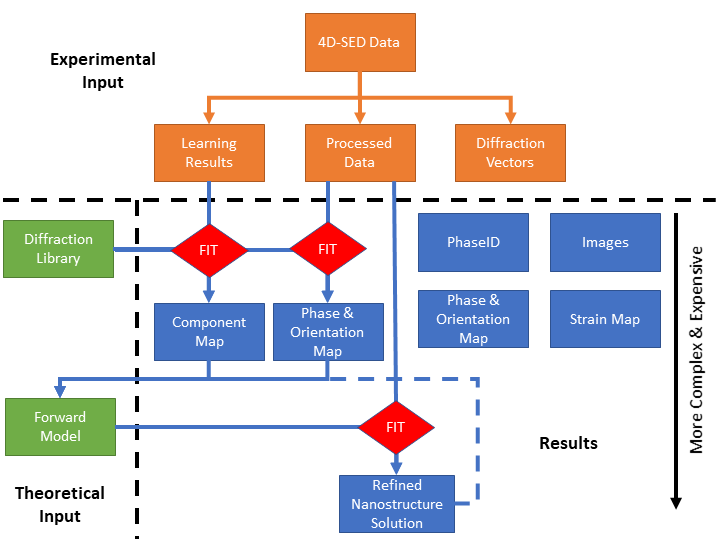
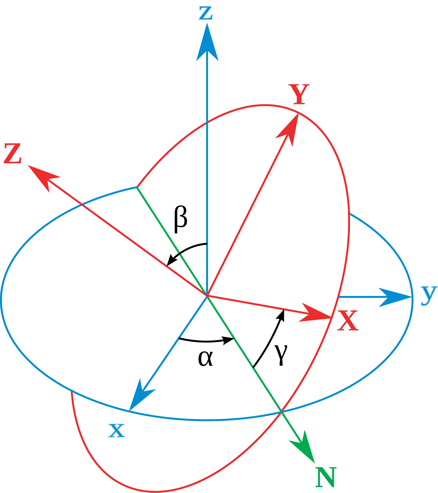

Architecture & Conventions
==========================

pyXem provides a library of tools primarily developed for the analysis of
4D-S(P)ED data, although many methods are applicable to electron diffraction
data in general. 4D-S(P)ED datasets comprise many thousands of electron
diffraction patterns and the :py:class:`~.ElectronDiffraction` class provides a
specialized HyperSpy Signal() class for this data. If the data array is imagined
as a tensor, D, of rank n then entries are addressed by n indices, D_{i,j,...,n}.
The HyperSpy Signal() class allows some indices, or equivalently some axes, to
be defined as navigation axes and others to be defined as signal axes. In the
context of a 4D-S(P)ED data, the two axes corresponding to the real-space scan
dimensions (i, j) are set as navigation axes and the two axes corresponding to
the diffraction pattern plane (a, b) are set as signal axes, which can be
written:

.. code-block:: python

    <i, j | a, b>

    |

    To illustrate the data methods implemented in pyXem we will consider data from a
    model system of GaAs nanowires comprising a series of twinned regions along its
    length, as shown below. (We acknowledge Prof. Ton van Helvoort, NTNU, Norway, for
    providing these samples).

    |

    .. figure:: images/model_system.png
       :align: center
       :width: 600

Architecture
------------

There are numerous ways to obtain physical insight from 4D-S(P)ED data all of
which ultimately require the assignment of an atomic arrangement to each probe
position that explains the observed diffraction. Different approaches to achieve
this goal are summarized in the following schematic.

Conventions
-----------

Various conventions are adopted within pyXem, as detailed here.

Diffraction Pattern Coordinates
^^^^^^^^^^^^^^^^^^^^^^^^^^^^^^^

Following alignment and calibration of two-dimensional diffraction data in the
ElectronDiffraction class, i.e.

.. code-block:: python

    >>> dp.set_diffraction_calibration(0.01)

Coordinates in the two-dimensional diffraction pattern are typically Cartesian
coordinates referred to an origin at the center of the diffraction pattern with
 the lower right hand quadrant positive. Coordinates may also be expressed as
 polar coordinates with the positive rotation an anticlockwise rotation. These
 conventions are depicted below:

Physical Units
^^^^^^^^^^^^^^

When physical units are used it is anticipated that we have:

1) Diffraction plane units of reciprocal Angstroms i.e. g = 1/d.
2) Atomic structure coordinates in Angstroms.
3) Scan coordinates in nanometres.

Crystallographic Axes
^^^^^^^^^^^^^^^^^^^^^

Atomic structures are manipulated in pyXem using the diffpy.Structure module and
crystallographic conventions are therefore primarily inherited from there.
Unless otherwise stated it will be assumed that a crystal structures is
described in the standard setting as defined in the `International Tables for Crystallography <https://it.iucr.org/A/>`__

Crystal orientations/rotations are typically described with respect to an
orthonormal basis, which must be related to the crystallographic basis in a
consistent manner. For further discussion see, for example, the following
article by `Rowenhorst et al <http://iopscience.iop.org/article/10.1088/0965-0393/23/8/083501/meta>`__. In pyXem it is assumed that these axes are related according to the metric tensor defined in a
diffpy.structure.lattice object.

Rotations
^^^^^^^^^

These are in the rzxz convention, as defined in `transforms3d <https://matthew-brett.github.io/transforms3d/reference/transforms3d.euler.html>`__. This means that we
rotate about z (by alpha), then the new x (by beta), and finally the new z (by gamma),
as illustrated below:

