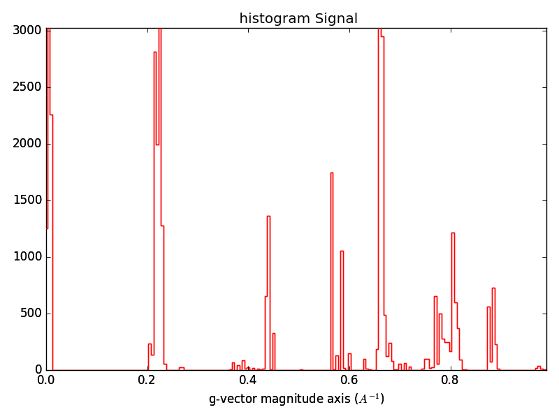

Diffraction Vector Analysis
===========================

The :py:class:`~.DiffractionVectors` class defines an object that contains
experimentally measured two-dimensional diffraction vectors as well as methods
that may be applied using these vectors.

:py:class:`~.DiffractionVectors` are obtained by applying
:py:method:`~.ElectronDiffraction.find_peaks` to an :py:class:`~.ElectronDiffraction`
object.

.. code-block:: python

    >>> dp = pxm.load('test_data.hspy')
    >>> dp = pxm.ElectronDiffraction(dp)
    >>> peaks = dp.find_peaks(method='difference_of_gaussians',
                              min_sigma=1.0,
                              max_sigma=50,
                              sigma_ratio=1.6,
                              threshold=0.005,
                              overlap=0.2)

Plotting Diffraction Vectors
----------------------------

.. code-block:: python

    >>> peaks.plot_diffraction_vectors(xlim=1.2, ylim=1.2)

Vector Magnitudes Histogram
---------------------------

Diffraction vectors correspond to reciprocal lattice vectors, to a first
approximation, with some absences due to lattice type. A list of allowed
diffraction vector magnitudes therefore provides a fingerprint for a particular
crystal lattice. The diffraction vector magnitudes present in a 4D-S(P)ED dataset
may be evaluated using :py:method:`~.DiffractionVectors.get_`.

.. code-block:: python

    >>> bins = np.arange(0, 1.5, 0.01)
    >>> ghist = peaks.get_magnitude_histogram(bins=bins)
    >>> ghist.plot()

Diffraction vector magnitude histograms effectively provide a denoised radial
profile of the diffraction data that may be used for phase identification by
comparison with known interplanar spacings for possible crystal structures.

Vector Indexation
-----------------

Vector Based Imaging & Segmentation
-----------------------------------

A complete set of diffraction contrast images revealing the spatial variation in
diffraction condition in a given 4D-S(P)ED dataset can be obtained by forming a
virtual diffraction contrast image with an integration window positioned at each
unique diffraction vector in the dataset. This is achieved using the
:py:method:`~.DiffractionVectors.get_virtual_images` method.

.. code-block:: python

    >>> vdfs = peaks.get_vdf_images(dp, 0.05, normalize=False)
    >>> vdfs.plot()

The complete set of images obtained can be analyzed further to reveal
microstructure and may be used to segment the data by identifying diffraction
vectors produced by the same crystal.
