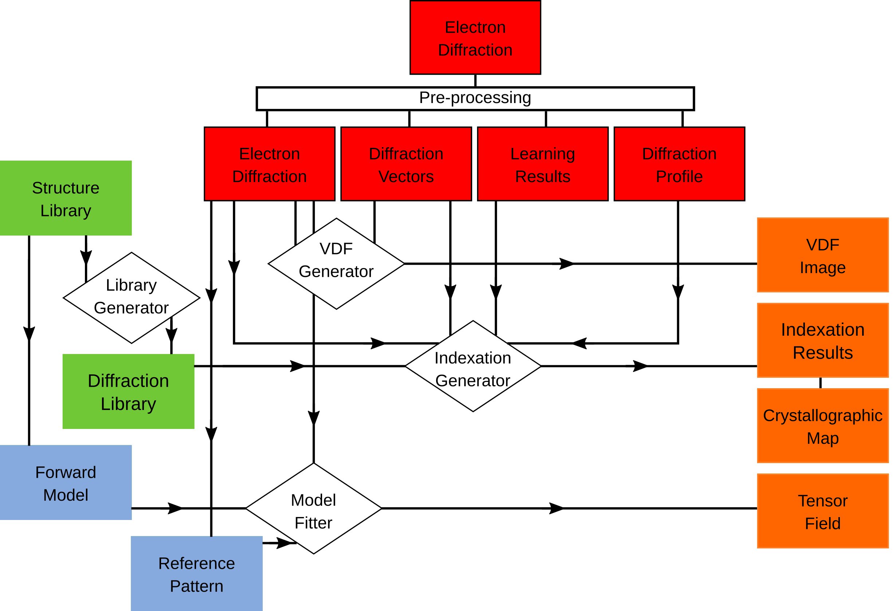

.. pyxem documentation master file, created by
   sphinx-quickstart on Fri Sep 16 14:34:23 2016.
   You can adapt this file completely to your liking, but it should at least
   contain the root `toctree` directive.

.. toctree::
    :hidden:

    self
    conventions
    literature

.. figure:: images/forkme_right_orange_ff7600.png
    :align: right
    :target: https://github.com/pyxem/pyxem

pyXem - Crystallographic Electron Microscopy in Python
======================================================

.. image:: https://travis-ci.org/pyxem/pyxem.svg?branch=master
    :target: https://travis-ci.org/pyxem/pyxem

.. image:: https://coveralls.io/repos/github/pyxem/pyxem/badge.svg?branch=master
    :target: https://coveralls.io/github/pyxem/pyxem?branch=master

pyXem is an open-source Python library for crystallographic electron microscopy.
The code is primarily developed as a platform for hybrid diffraction-imaging
microscopy based on scanning (precession) electron diffraction (S(P)ED) data.
This approach may be illustrated schematically, as follows:

.. figure:: images/sped_scheme.png
   :align: center
   :width: 600

pyXem is released under the GPL v3 license.

If analysis using pyxem forms a part of published work please consider recognizing the 
code development by citing the github repository.

Installation
------------

pyXem requires python 3 and conda (to install a Py3 compatitble version of diffpy) - we suggest using the python 3 version of `Miniconda <https://conda.io/miniconda.html>`__. and creating a new environment for pyxem using the following commands in the anaconda prompt:::

      $ conda create -n pyxem
      $ conda activate pyxem

The following commands will then install everything you need if entered into the anaconda promt (or terminal) when located in the pyxem directory:::

      $ conda install -c conda-forge diffpy.structure
      $ conda install -c anaconda cython
      $ conda install -c conda-forge spglib
      $ conda install -c conda-forge traits
      $ pip install . -r requirements.txt

Getting Started
---------------

To get started using pyxem, especially if you are unfamiliar with python, we recommend using jupyter notebooks. Having installed pyxem as above, a jupyter notebook can be opened using the following commands entered into an anaconda prompt or terminal:::

      $ conda activate pyxem
      $ jupyter notebook

`Tutorials and Example Workflows <https://github.com/pyxem/pyxem-demos>`__ have been curated as a series of jupyter notebooks that you can work through and modify to perform many common analyses.

Documentation
-------------

`Documentation <http://pyxem.github.io/pyxem/pyxem>`__ is available for all pyxem modules at the following links:

- `pyxem.signals <http://pyxem.github.io/pyxem/pyxem.signals>`__ - for manipulating raw data and analysis results.

- `pyxem.generators <http://pyxem.github.io/pyxem/pyxem.generators>`__ - for establishing simulation and analysis conditions.

- `pyxem.components <http://pyxem.github.io/pyxem/pyxem.components>`__ - for fitting in model based analyses.

- `pyxem.libraries <http://pyxem.github.io/pyxem/pyxem.libraries>`__ - that store simulation results needed for analysis.

4D-SED Analysis Workflows
-------------------------

Pyxem is an extension of the `HyperSpy <http://hyperspy.org>`__ library, specialized for the analysis of 
multi-dimensional electron diffraction data. The hyperspy platform provides easy access to a plethora of 
scientific python libraries with a syntax designed for multi-dimensional data based on the :py:class:`hyperspy.signals.Signal2D` class, which is sub-classed by :py:class:`~.ElectronDiffraction`.

In this scheme, real space coordinates (x, y) are considered “navigation axes” and reciprocal
space coordinates (kx, ky) are considered “signal axes”, which may be easily addressed separately. 
To make this distinction clear, 4D-SED data may be denoted:

.. code-block:: python

    >>> <x, y | kx, ky>

Objects defined in the various `pyxem modules <http://pyxem.github.io/pyxem/pyxem>`__  may be processed together 
in to construct a wide range of different analysis workflows, as illustrated below.

Related Packages
----------------

The following packages are developed by the pyXem team:

- `texpy <http://pyxem.github.io/pyxem/texpy>`__- for quaternion, rotation, and orientation handling in Python.

These packages are central to the scientific functionality of pyXem:

- `HyperSpy <http://hyperspy.org>`__ for multi-dimensional data handling.

- `DiffPy <http://diffpy.org>`__ - for atomic structure manipulation. 

.. warning::

    The pyXem project is under continual development and there may be bugs. All methods must be used with care.
