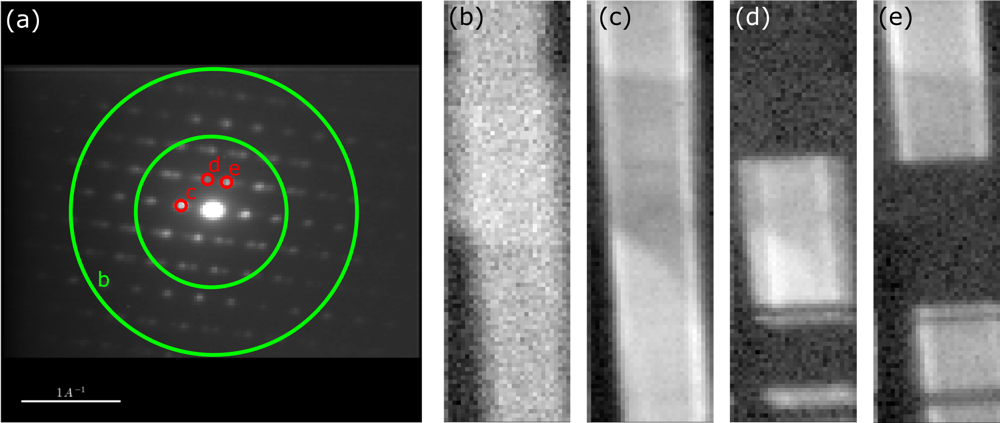

Intermediate
============

Post-facto Imaging
------------------

'Virtual' images are formed post-facto from scanning electron diffraction data
by plotting the scattered intensity in a subset of pixels in the diffraction
plane as a function of probe position. This is achieved by specifying a region
of interest (roi) in the diffraction plane within which intensity is summed.

Post-facto imaging can be performed interactively, as follows:

.. code-block:: python

    >>> dp = pxm.load('nanowire_precession.hdf5')
    >>> roi = pxm.roi.CircleROI(cx=0.,cy=0, r_inner=0, r=0.07)
    >>> dp.plot_interactive_virtual_image(roi=roi)

Note: It is important to ensure that the SED data is well aligned when interpreting
contrast in virtual images.

Virtual images are typically formed to obtain diffraction contrast. A virtual
bright-field (VBF) image is formed by plotting the intensity within a disk positioned
at the centre of the diffraction pattern, around the direct beam. Virtual dark-field
(VDF) images are formed by plotting the intensity within pixels not containing the
direct beam. This integration window may typically be either an annulus positioned
around the centre of the diffraction pattern, or a disk centered on a particular
diffracted beam. Examples of such virtual images are shown below.

   
   
Unsupervised Machine Learning
-----------------------------

Unsupervised machine learning algorithms may be applied to SED as a route to
obtain representative "component diffraction patterns" and their respective
"loadings" in real space. These methods involve unfolding each diffraction
pattern into an image vector and stacking these vectors together to construct a
data matrix, which is then factorized:

.. figure::  images/ml_sed_scheme.png
   :align: center
   :width: 600

Various matrix decomposition methods are available through the decomposition()
method, which is inherited directy from HyperSpy and is documented
`here <http://hyperspy.org/hyperspy-doc/current/user_guide/mva.html>`__.

.. code-block:: python

    >>> dp.decomposition()

