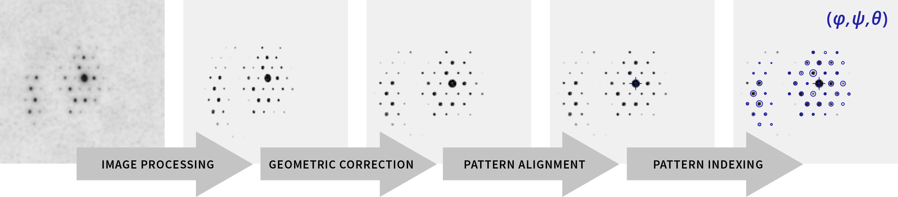

Orientation Mapping
===================

Orientation mapping can be achieved in a number of ways based on the acquisition
of numerous electron diffraction patterns in the scanning transmission
electron microscope.

Pattern Matching
----------------

Pattern matching, whereby each diffraction pattern in the 4D-S(P)ED dataset is
compared to a library of pre-computed theoretical templates, has become the most
common method of assigning crystal phase and orientation to each recorded pattern.
The implementation described here follows work by Rauch et al. The steps involved
in achieving successful pattern matching are illustrated below.

Diffraction Library Generation
******************************

Generating a library of theoretical templates involves specification of the
crystal phases and orientations to be included, followed by simulation of a
template diffraction pattern corresponding to each phase and orientation. Although
it might be appealing to include all known phases and orientations this will
result in a very library generation times. Thus, in practice, it is preferable
to use prior knowledge to limit the template library to a minimal but sufficient
size. For phases, it is usually simple limited to a small number of likely phases
based on previous characterisation. The orientations to be included are most
generally selected as a uniform sampling of symmetry inequivalent orientations
corresponding to the crystallography of the given phases. The symmetry
inequivalence is very important. True uniform sampling of orientation space
requires consideration of the topology of orientation space. Pyxem contains
utility functions, (e.g. - :py:method:`~utils.sim_utils.get_equispaced_so3_grid`
to assist in this matter.

E.g. for cubic symmetry:

.. code-block:: python

    >>> orientations = equispaced_so3_grid(90,180,90,5)

Pre-calculated orientation grids with approximately 1 degree angular resolution
are also available for all proper rotational point groups `here <https://drive.google.com/open?id=1Xj064eDB9D5drYOuCkdzwZmR5lcCULPG>`__.

A structure library can then be constructed containing all the expected phases,
which are defined as PyMatGen structures and corresponding orientations.

.. code-block:: python

    >>> structure = pmg.Structure.from_file('ga_as.cif')
    >>> structure_lib = dict()
    >>> structure_lib["A"] = (structure, orientations)

Simulation of template patterns may, in principle, be achieved using any of the
diffraction simulation methods implemented in pyXem. The simulator is set up in
the :py:class:`~.DiffractionGenerator` class, for example as:

.. code-block:: python

    >>> edc = pxm.DiffractionGenerator(300, 5e-2)

A library of diffraction patterns for all orientations of expected phases can
then be generated using an appropriate :py:class:`~.DiffractionLibraryGenerator`.

.. code-block:: python

    >>> diff_gen = pxm.DiffractionLibraryGenerator(edc)
    >>> library = diff_gen.get_diffraction_library(structure_lib,
                                                   calibration=recip_cal,
                                                   reciprocal_radius=1.,
                                                   half_shape=(72,72),
                                                   representation='euler',
                                                   with_direct_beam=False)

Pattern Matching Metric
***********************

The best fitting simulated pattern corresponding to every experimental
diffraction pattern is determined using a :py:class:`~.IndexationGenerator` as
follows:

.. code-block:: python

    >>> indexer = IndexationGenerator(dp, library)
    >>> match_results = indexer.correlate()

The correlation index, Q, used to achieve this matching is defined as:

.. math::
    Q = \frac{\Sigma P(x,y) T(x,y)}{\sqrt[]{\Sigma T^{2}(x,y)}}

where P(x,y) is the intensity of the pixel with coordinates (x,y) in the
experimental diffraction pattern and T(x,y) is the intensity of template at
(x,y). Q is evaluated for each template, and the template with the largest value
is considered to be correct for this P.
