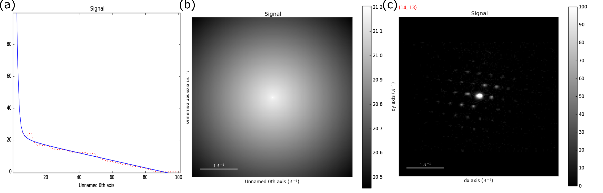
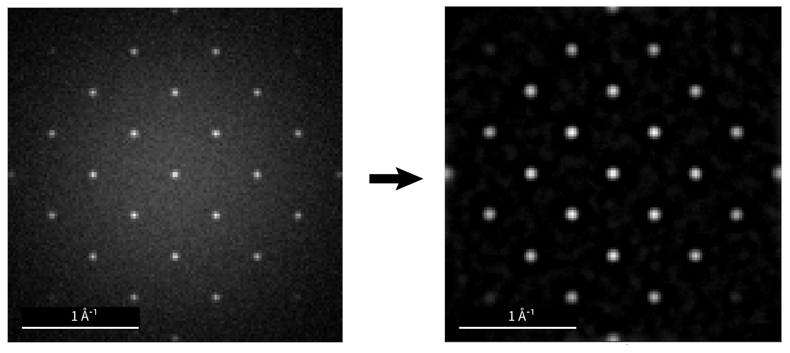

Pre-processing
==============

Experimental parameters associated with the data acquisition can be stored in
metadata using one of the methods of the ElectronDiffraction class, as shown below

.. code-block:: python

    >>> dp.set_experimental_parameters(accelerating_voltage=300.,
                                       camera_length=21.,
                                       scan_rotation=277.,
                                       convergence_angle=0.7,
                                       exposure_time=10.)


Alignment, Corrections & Calibration
------------------------------------

Experimental artifacts in 4D-S(P)ED commonly include: (1) geometric distortions
due to projection optics, (2) small translations of the direct beam in the
diffraction plane, and (3) recorded intensities that depend on the response of
the detector. Methods to correct these effects to a first order approximation
are made available in pyXem.

Projection distortions may be (approximately) corrected by the application of an
opposite image distortion, often an affine transformation, to all recorded
diffraction patterns. The appropriate transformation may be determined using
diffraction patterns acquired from a reference sample and then applied using
:py:meth:`~.ElectronDiffraction.apply_affine_transformation`. E.g.

.. code-block:: python

    >>> dp.apply_affine_transformation(np.array([[0.99,0   ,0],
                                                 [0   ,0.69,0],
                                                 [0   ,0   ,1]]))

Translation of the direct beam is corrected for by aligning the stack of
diffraction patterns. This can be achieve with

.. code-block:: python

    >>> dp.center_direct_beam(radius_start=3, radius_finish=5)

This method has two mandatory arguments, you can find out more about these by inspecting the relevant docstrings.

Intensity corrections most simply involve gain normalization based on
dark-reference and bright-reference images. Such gain normalization may be
performed in pyXem using :py:meth:`~.ElectronDiffraction.apply_gain_normalisation`.

.. code-block:: python

    >>> dp.apply_gain_normalisation(bref=bright_reference, dref=dark_reference)

Following alignment and the application of necessary corrections to the data (ESSENTIAL DO NOT SKIP!), one
may be calibrate the signals. Methods exist to apply calibrations to the diffraction and scan axes respectively.

.. code-block:: python

    >>> dp.set_diffraction_calibration(0.01)
    >>> dp.set_scan_calibration(10)

.. note:: The diffraction axes should be calibrated in A^{-1}/px and the scan
    axes should be calibrated in nm/px.


Radial Integration
------------------

The :py:meth:`~.ElectronDiffraction.get_radial_profile` method integrates every
two-dimensional electron diffraction pattern about its geometric center and is applied as:

.. code-block:: python

    >>> dp.get_radial_profile()

The result is a one-dimensional plot of diffracted intensity as a function of
scattering angle. This will not work if you fail to center all of the patterns in your S(P)ED scan.


Background Removal
------------------

Background subtraction is important for extracting accurate diffracted
intensities and achieving reliable pattern matching or peak finding. The aims in
these two cases are significantly different. Background subtraction may be
achieved in pyXem via the :py:meth:`~.ElectronDiffraction.remove_background`
method, which has multiple options.

The background may be modelled by fitting a model to the radial profile of the
diffraction data. The model may then be made ciruclarly symmetric and subtracted.
Numerous models could in principle be used and one option that has been useful
for data acquired on fluorescent screens, but is difficult to justify physically,
contains a Lorentzian to model the direct beam, an exponential function to
model the tail of diffuse scattering, and a first order polynomial to model
slower decay at higher scattering angles. This is applied as:

.. code-block:: python

    >>> dp.remove_background(method='model')

Backgound modelling, as described above yields the following:



Background removal based on morphological operations provides a fast and
versatile method for removing non-smooth background. A so-called h-dome method
is implemented here. This involves forming a 'seed' image by subtracting a
constant offset, h, from the raw image. A morphological reconstruction by
dilatation is then performed in which high-intensity values replace nearby low
intensity values. The seed image specifies the values that are subject to
dilatation and the raw image specifies the maximum value at each pixel. The
reconstructed image then appears similar to the original image but with peak
above the h value cut off.

.. code-block:: python

    >>> dp.remove_background(method='h-dome', h=0.4)

Morphological background removal, as described above yields the following:




Peak Finding
------------

The :py:meth:`~.ElectronDiffraction.find_peaks` method provides access to a
number of algorithms for that achieve peak finding in electron diffraction
patterns. There are currently five methods avaliable, a good place to start
though is to run the interactive peakfinder in a Jupyter Notebook

.. code-block:: python

    >>> dp.find_peaks_interactive()

Many of the peak finding algorithms implemented here have a number of tuneable
parameters that significantly affect their accuracy and speed. Finding the
correct parameters can be difficult. An interactive tool for the Jupyter
notebook has been developed to help.

Several widgets are available:

.. figure::  images/interactive_peaks.png
   :align: center
   :width: 600

* The method selector is used to compare different methods. The last-set
  parameters are maintained.
* The signal navigator is used where a signal has navigation axes. The
  randomizer will select random indices.
* The parameter adjusters will update the parameters of the method and re-plot
  the new peaks.

.. note:: Some methods take significantly longer than others (the statistical method is particularly slow). The plotting window
    may be inactive during this time.

Running in a script is then simple.

Zaefferer
`````````

.. code-block:: python

    >>> dp.find_peaks(method='zaefferer')

This algorithm was developed by Zaefferer and the implementation here is after
the description of the algorithm in the Ph.D. thesis of Thomas A. White. It is
based on a gradient threshold followed by a local maximum search within a square
window, which is moved until it is centered on the brightest point, which is
taken as a peak if it is within a certain distance of the starting point.

Stat
````
.. code-block:: python

    >>> dp.find_peaks(method='stat')

Developed by Gordon Ball, and described in the Ph.D. thesis of Thomas A.
White, this method is based on finding points which have a statistically
higher value than the surrounding areas, then iterating between smoothing and
binarising until the number of peaks has converged. This method is slow, but
very robust to a variety of image types.

Matrix Methods
``````````````

.. code-block:: python

    >>> dp.find_peaks(method='laplacian_of_gaussians')
    >>> dp.find_peaks(method='difference_of_gaussians')

These methods are essentially wrappers around the
`scikit-image <http://scikit-image
.org/docs/dev/auto_examples/plot_blob.html>`_ Laplacian
of Gaussian and Difference of Gaussian methods, based on stacking the
Laplacian/difference of images convolved with Gaussian kernels of various
standard deviations. Both are very rapid and relatively robust, given
appropriate parameters.

Cross Correlation
`````````````````

.. code-block:: python

    >>> disc = np.ones((2,2))
    >>> dp.find_peaks(method='xc',disc_image=disc)

The final method is based on cross correlation, forming a thin wrapper over
the template matching code avaliable in scikit-image `<http://scikit-image
.org/docs/dev/auto_examples/features_detection/plot_template.html>`_
