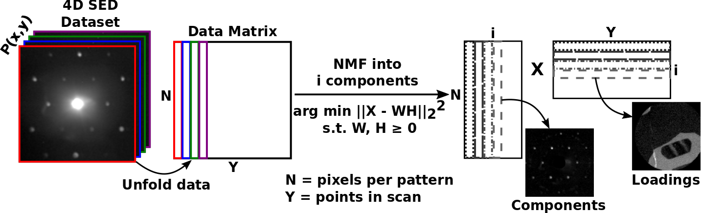

Unsupervised Machine Learning
=============================

Unsupervised machine learning algorithms may be applied to SED as a route to
obtain representative "component diffraction patterns" and their respective
"loadings" in real space. These methods involve unfolding each diffraction
pattern into an image vector and stacking these vectors together to construct a
data matrix, which is then factorized:

Various matrix decomposition methods are available through the decomposition()
method, which is inherited directy from HyperSpy and is documented
`here <http://hyperspy.org/hyperspy-doc/current/user_guide/mva.html>`__.

.. code-block:: python

    >>> dp.decomposition()
